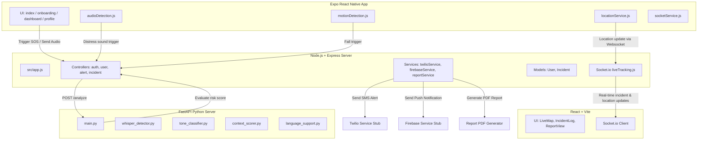

# ARIA: AI Real-time Incident Assistant

ARIA (AI Real-time Incident Assistant) is a production-quality, hackathon-ready monorepo designed to secure public and women's safety through AI, real-time GPS streaming, and an emergency response dashboard.

## System Architecture



---

## Directory Structure

```text
aria/
├── README.md                      # Architecture diagram and installation instructions
├── package.json                   # Root workspace management definition
├── backend/                       # Node.js, Express, Socket.io, PDFKit server
│   ├── src/
│   │   ├── app.js                 # Backend entrypoint
│   │   ├── routes/                # auth, user, alert, incident endpoints
│   │   ├── controllers/           # Endpoint handlers
│   │   ├── models/                # User & Incident schemas (memory backed with fallback)
│   │   ├── services/              # SMS (Twilio), Push (Firebase), PDF Report generators
│   │   └── sockets/               # liveTracking socket setup
│   └── .env.example
├── police-dashboard/              # React, Vite, Leaflet browser UI
│   ├── src/
│   │   ├── pages/                 # Dashboard overview, Live GPS Map, Log, Reports
│   │   ├── App.jsx                # Layout and router integration
│   │   ├── index.css              # Custom styled, premium design rules
│   │   └── main.jsx
│   └── vite.config.js
├── ai-engine/                     # Python FastAPI AI processing engine
│   ├── requirements.txt
│   ├── main.py                    # API endpoints (POST /analyze)
│   ├── whisper_detector.py        # Voice-to-text decoder stub
│   ├── tone_classifier.py         # Acoustic classification stub
│   ├── context_scorer.py          # Ambient context evaluation formula
│   └── language_support.py        # Bilingual distress dictionary (English & Hindi)
└── mobile/                        # React Native Expo mobile application
    ├── app/                       # Onboarding, Dashboard status tracker, profile screens
    ├── components/                # Pulse SOS trigger button, AlertBanner, StatusIndicator
    └── services/                  # Audio parsing, motion analysis, GPS updates, and socket connections
```

---

## Installation and Setup Instructions

### Prerequisites
1. **Node.js**: v18+ is recommended
2. **Python**: v3.9+ is recommended

### Quick Start (Dev Mode)

To start everything simultaneously, install dependencies and launch each service:

#### 1. Start the AI Engine
```bash
cd ai-engine
python -m venv venv
# Windows:
venv\Scripts\activate
# Unix/macOS:
source venv/bin/activate

pip install -r requirements.txt
uvicorn main:app --reload --port 8000
```

#### 2. Start the Backend
```bash
cd backend
npm install
npm run dev
```

#### 3. Start the Police Dashboard
```bash
cd police-dashboard
npm install
npm run dev
```

#### 4. Start the Mobile Client
```bash
cd mobile
npm install
npx expo start
```

---

## API Endpoints List

### Express Backend APIs (`http://localhost:5000`)
| Method | Endpoint | Description | Auth Required |
|:---|:---|:---|:---|
| `POST` | `/api/auth/register` | Register a new user | No |
| `POST` | `/api/auth/login` | Authenticate user and receive JWT | No |
| `GET` | `/api/user/profile` | Retrieve profile metadata | Yes (Bearer Token) |
| `POST` | `/api/incidents/create` | Manually initiate an incident log | Yes (Bearer Token) |
| `GET` | `/api/incidents` | Fetch all active/resolved incidents | No |
| `GET` | `/api/incidents/:id` | Fetch details of a single incident | No |
| `POST` | `/api/alerts/sos` | Trigger immediate alert and broadcast | Yes (Bearer Token) |
| `POST` | `/api/location/update` | Post latest coordinates | Yes (Bearer Token) |
| `POST` | `/api/report/generate` | Generate incident PDF and returns download URL | No |

### AI Engine APIs (`http://localhost:8000`)
| Method | Endpoint | Description |
|:---|:---|:---|
| `POST` | `/analyze` | Form-data audio analyze; classifies distress and transcribes |

---

## Hackathon Demo Script

Follow these steps to demonstrate the full capabilities of the ARIA ecosystem:

1. **Dashboard Setup**: Open `police-dashboard` (Vite) on your browser. Observe the empty dashboard state.
2. **Launch Mobile Client**: Open `mobile` app or simulate it. Create an account (`/api/auth/register`) and log in.
3. **Configure Emergency Contacts**: Go to the Profile page on the mobile app and add names and phone numbers.
4. **Trigger Incident (Auto / Manual)**:
   - **Auto Mode**: Audio monitor notices "help" or "bachao" in the microphone stream, OR the accelerometer detects a sharp deceleration (fall).
   - **Manual Mode**: Long-press the pulsing **SOS Button** on the mobile dashboard.
5. **Real-time Broadcast**:
   - The phone sends coordinates to the Backend Server.
   - The backend pushes an alert payload.
   - The police map automatically scrolls, plots a glowing red marker, and rings a warning alert.
6. **AI Analysis**:
   - The backend sends distress audio to the FastAPI engine.
   - The AI returns safety context (e.g. 91% distress probability, "Help me please" transcription) and an calculated Risk Score.
   - The Risk Score is rendered live on both the mobile interface and the police dashboard.
7. **Report Dispatch**:
   - Resolve the incident from the Police Dashboard.
   - Download the generated PDF containing full metadata (time, location, telemetry, voice transcript, contacts informed).
